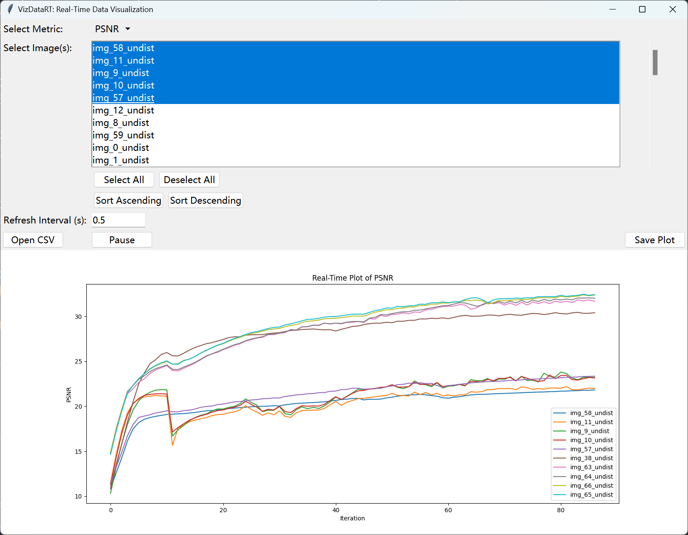

# **VizDataRT**

*实时监控和可视化训练过程中指标的工具。*

## **项目简介**

VizDataRT 是一个用于实时绘制和监控机器学习模型训练过程中各种指标（如 PSNR、L1、SSIM、损失函数等）的可视化工具。通过读取 CSV 文件，VizDataRT 可以动态更新绘图，方便研究者和工程师直观地观察模型性能的变化。

## **功能特性**

- **实时更新**：每隔一定时间（可自定义）读取数据并更新绘图。
- **多指标支持**：支持绘制 PSNR、L1、SSIM、先验损失、深度损失等指标。
- **多图像选择**：可选择多个图像，分别绘制其对应的指标曲线。
- **指标排序**：根据选定指标，对图像列表进行升序或降序排序。
- **交互式界面**：用户友好的 GUI，支持全选、反选、排序和刷新操作。
- **可定制刷新间隔**：用户可根据需要调整数据刷新频率。
- **打开 CSV 文件**：支持在程序运行时打开新的 CSV 文件，方便切换数据源。
- **保存绘图**：一键保存当前的绘图为图片文件，便于分享和分析。
- **错误提示**：在界面上显示错误信息，方便用户了解程序状态。
- **暂停/继续更新**：支持暂停和继续实时更新，方便用户查看当前数据。

## **安装**

### **环境要求**

- Python 3.6 或更高版本
- 操作系统：Windows、macOS、Linux

### **依赖库**

- pandas
- matplotlib
- tkinter（通常随 Python 安装）
- numpy

### **安装步骤**

1. **克隆仓库**

   ```bash
   git clone https://github.com/IHKYoung/VizDataRT.git
   cd VizDataRT
   ```

2. **安装依赖**

   ```bash
   pip install -r requirements.txt
   ```

## **使用说明**

### **运行程序**

在命令行中，执行以下命令：

```bash
python VizDataRT.py path/to/your/data.csv --refresh-interval 0.5
```

- `path/to/your/data.csv`：替换为您的 CSV 文件路径。
- `--refresh-interval`（可选）：数据刷新间隔，单位为秒，默认为 `0.5` 秒。

### **CSV 文件格式**

CSV 文件应包含以下列（至少包括 `image_name` 和一个指标列）：

- `image_name`
- `PSNR`
- `l1`
- `ssim_loss`
- `prior_loss`
- `depth_loss`

示例内容：

```csv
image_name,l1,ssim_loss,prior_loss,depth_loss,PSNR
img_pinhole_0_0,0.1466,0.2343,0.8620,0.2880,13.3673
img_pinhole_0_2,0.1127,0.2343,0.8581,0.2852,15.7933
...
```

### **界面介绍**

- **Select Metric**：选择要绘制的指标。
- **Select Image(s)**：选择要绘制的图像，可多选。
- **Select All / Deselect All**：全选或取消选择所有图像。
- **Sort Ascending / Sort Descending**：根据选定指标，对图像列表进行升序或降序排序（基于最新值计算）。
- **Refresh Interval (s)**：设置数据刷新间隔（秒），输入新的值并按回车键确认。
- **Open CSV**：打开新的 CSV 文件，切换数据源。
- **Save Plot**：保存当前绘制的图像为图片文件。
- **Pause/Resume**：暂停或继续实时更新数据和绘图。

### **运行截图**



### **使用步骤**

1. **启动程序**：按照上述方式运行程序，界面将自动弹出。

2. **选择指标**：在“Select Metric”下拉菜单中选择要查看的指标。

3. **选择图像**：在“Select Image(s)”列表中选择要查看的图像，可以按住 `Ctrl` 键多选。

4. **全选/取消全选**：使用“Select All”或“Deselect All”按钮快速选择或取消选择所有图像。

5. **排序图像**：点击“Sort Ascending”或“Sort Descending”按钮，根据当前选定的指标对图像进行排序，方便选择指标最高或最低的图像。

6. **调整刷新间隔**：在“Refresh Interval (s)”输入框中输入新的刷新间隔（秒），按回车键确认。程序将按照新的间隔刷新数据和绘图。

7. **打开新的 CSV 文件**：点击“Open CSV”按钮，选择新的数据文件，程序将自动加载并更新界面。

8. **保存当前绘图**：点击“Save Plot”按钮，选择保存路径和文件名，程序将当前的绘图保存为图片文件。

9. **暂停/继续更新**：点击“Pause”按钮，可以暂停实时更新，再次点击“Resume”按钮，恢复实时更新。

### **注意事项**

- 确保 CSV 文件的路径正确，程序会实时读取该文件。
- 调整刷新间隔时，请输入正数，例如 `0.5`、`1.0` 等。
- 如果指标列不存在，程序会在界面上弹出错误提示。
- 在绘图过程中，如遇到数据加载错误或文件不存在等情况，程序会在界面上显示错误信息。

## **贡献指南**

欢迎对 VizDataRT 提出建议和改进。您可以通过以下方式参与：

- 提交问题（Issues）和功能请求。
- 创建拉取请求（Pull Requests）以修复问题或添加新功能。

## **许可协议**

[MIT License](LICENSE)

## **联系**

如果您有任何问题或建议，请通过以下方式联系：

- GitHub Issues：https://github.com/IHKYoung/VizDataRT/issues

---

**感谢您使用 VizDataRT，希望它能帮助您更高效地进行数据分析和模型调试！**